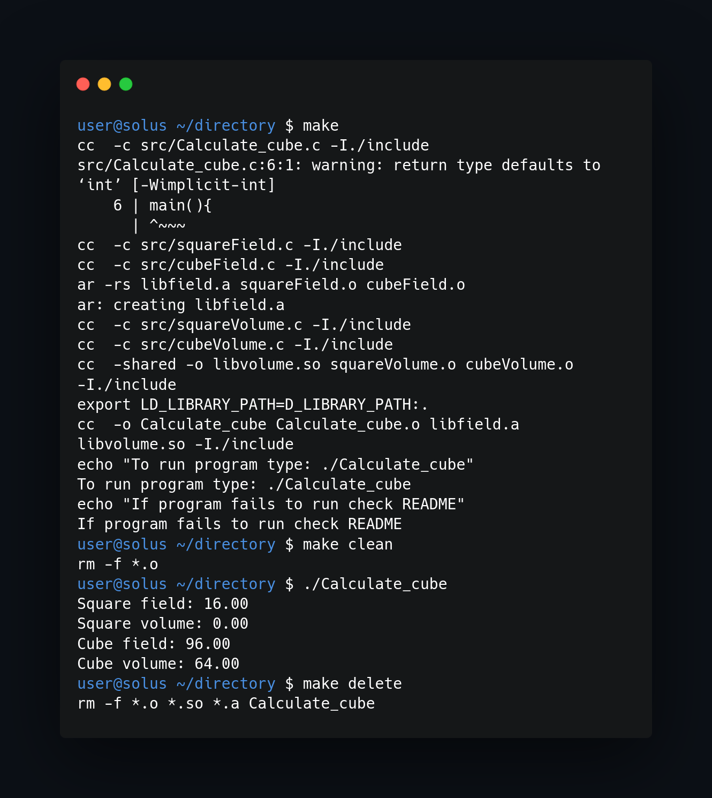

<!--badges-->


## What program do:
___
Program calculate field and volume of square and cube (the side length of geometric figure is hardcoded). The program is managed by Makefile to compile. 



## Compilation
___
To compile program just run "makefile" from your terminal. This will build object files and create libraries.


## Installation
___
To install program use makefile in Linux and run (in project directory): 
```
makefile 
makefile clean
```

## Delete program
___
To delete compiled program use:
makefile delete

## Troubleshooting
___
If you have difficulty running program after compilation and have error:
```
./Calculate_cube: error while loading shared libraries: libobjetosc.so: cannot open shared object file: No such file or directory
```
Use command: 
```
export LD_LIBRARY_PATH=$LD_LIBRARY_PATH:.
```
This problem occurs when shared library don't export properly and upper command adds current file to LD_LIBRARY_PATH variable that holds paths to shared libraries.

<!--https://banner.godori.dev/-->
<!--https://shields.io/-->
<!--https://carbon.now.sh/-->